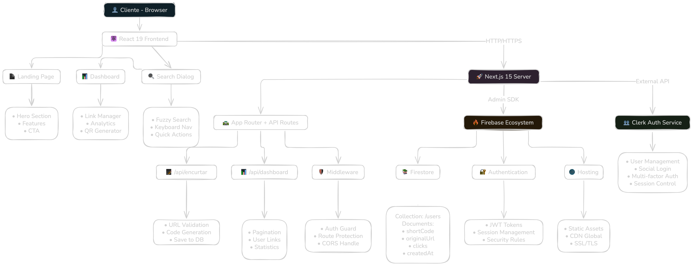
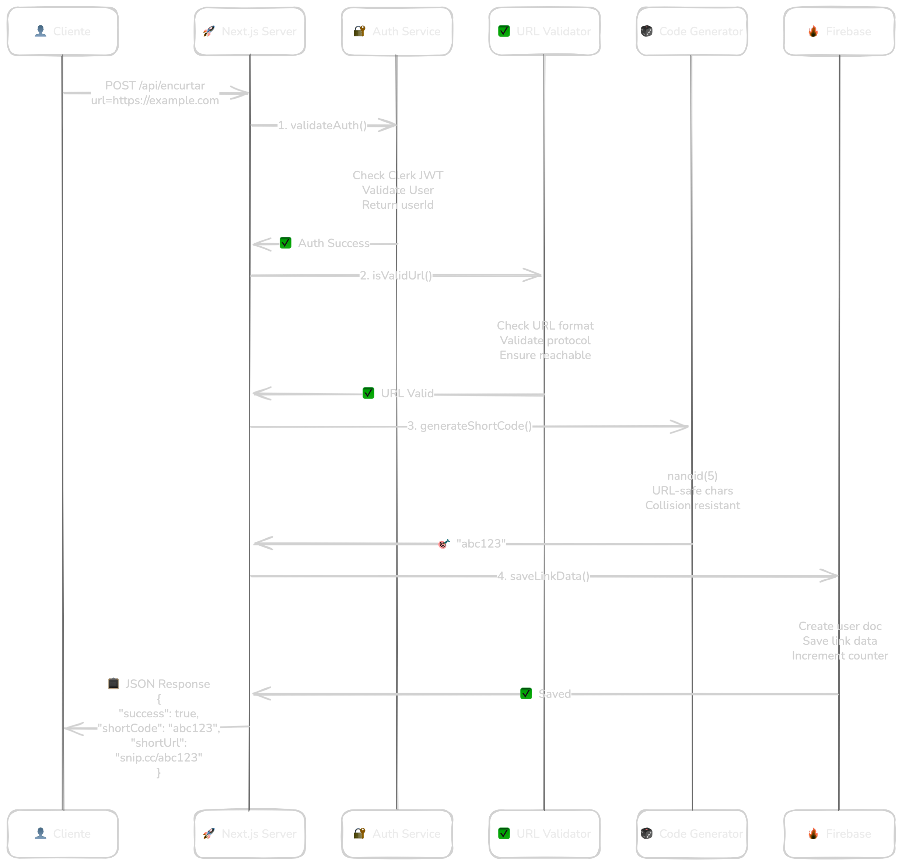
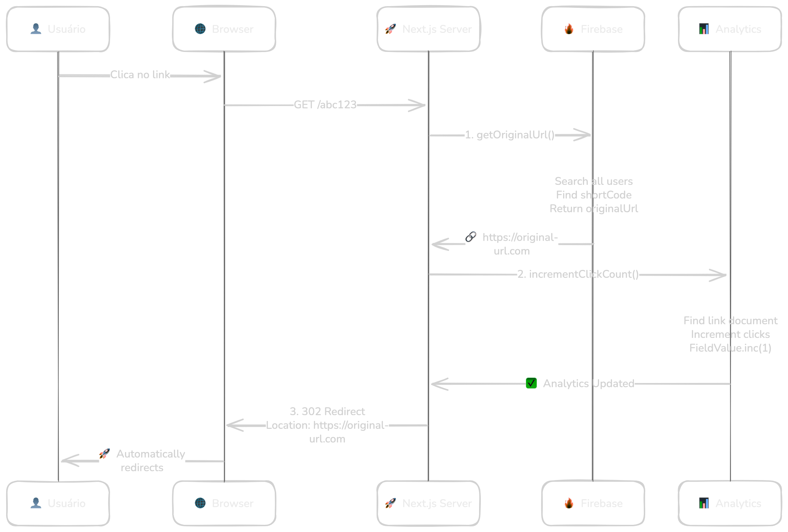
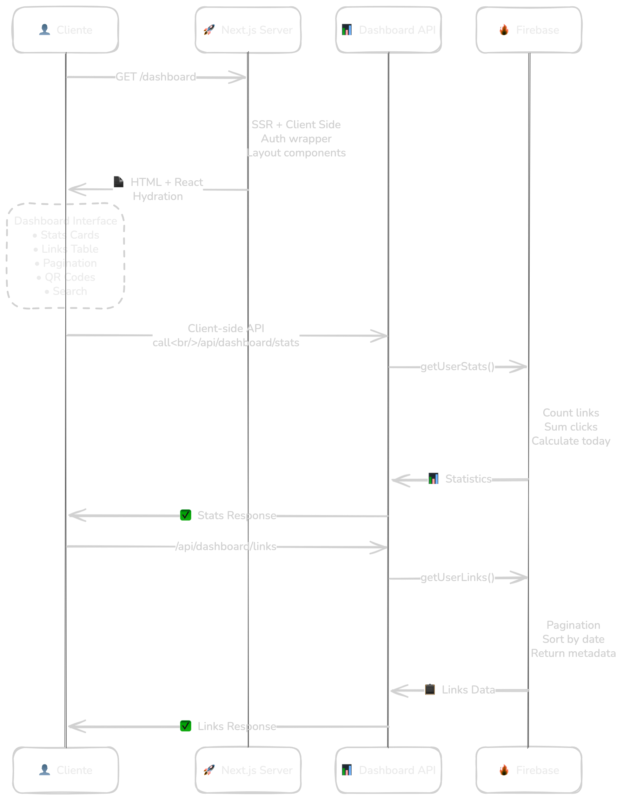

**Snip** é um encurtador de links moderno e inteligente desenvolvido com as mais recentes tecnologias web. O projeto combina performance, segurança e experiência do usuário em uma solução completa para encurtamento e análise de URLs.

### **Estatísticas do Projeto**
- **Arquitetura:** Full-stack com Next.js 15.5.2
- **Runtime:** Bun (ultra-fast JavaScript runtime)
- **Linguagem:** TypeScript 100%
- **Frontend:** React 19.1.0 com Server Components
- **Database:** Firebase Firestore (NoSQL)
- **Autenticação:** Clerk + Firebase Admin SDK
- **UI/UX:** Tailwind CSS + shadcn/ui
- **Deployment:** Vercel

---

## **Arquitetura do Sistema**



---

## **Fluxo de Requisições**

### **1. Encurtamento de URL**



### **2. Redirecionamento de Link**



### **3. Dashboard e Analytics**



---

## **Stack Tecnológico Detalhado**

### **Frontend**

#### **React 19.1.0**
- Hooks modernos (useState, useEffect, useMemo)
- Context API para estado global
- Suspense para loading states
- Error boundaries para tratamento de erros

#### **Next.js 15.5.2**
- App Router (nova arquitetura)
- Server Components para performance
- Static Site Generation (SSG)
- Incremental Static Regeneration (ISR)

#### **TypeScript**
- Type safety completo
- Interfaces bem definidas
- Strict mode habilitado
- IntelliSense avançado

#### **Styling**
- Tailwind CSS (utility-first)
- shadcn/ui (componentes pré-construídos)
- Design system consistente
- Dark theme por padrão

### **Backend**

#### **Bun Runtime**
- 3x mais rápido que Node.js
- Zero-config transpiler
- Built-in package manager
- WebAPI compatibility

#### **Next.js API Routes**
- Serverless functions
- Edge runtime support
- Middleware personalizado
- Type-safe endpoints

#### **Firebase Firestore**
- NoSQL document database
- Real-time synchronization
- Offline support
- Auto-scaling
- Global distribution

### **Autenticação**

#### **Clerk (Frontend)**
- Social login (Google, GitHub, etc.)
- Magic links
- Email/password
- Multi-factor authentication
- Session management

#### **Firebase Admin (Backend)**
- JWT token validation
- Server-side user management
- Secure API access
- Custom claims
- Role-based access control

---

## **Modelo de Dados**

### **Estrutura do Firestore**
```
snip-database
├── users/
│   ├── {userId}
│   │   ├── createdAt: Timestamp
│   │   ├── linksCount: number
│   │   └── links/
│   │       ├── {shortCode}
│   │       │   ├── shortCode: string
│   │       │   ├── originalUrl: string
│   │       │   ├── shortUrl: string
│   │       │   ├── analyticsUrl: string
│   │       │   ├── userId: string
│   │       │   ├── createdAt: Timestamp
│   │       │   ├── expiresAt: Timestamp | null
│   │       │   └── clicks: number
│   │       └── {shortCode2}...
│   └── {userId2}...
└── analytics/ (futuro)
    └── {shortCode}
        ├── totalClicks: number
        ├── uniqueClicks: number
        ├── countries: Map
        ├── devices: Map
        ├── referrers: Map
        └── dailyStats: Map
```

---

## **Features Principais**

### **1. Encurtamento Inteligente**
- **Algoritmo de geração:** nanoid(5) - 5 caracteres URL-safe
- **Probabilidade de colisão:** 1 em 60 milhões (com 5 chars)
- **Validação robusta:** URL parsing com try/catch
- **Sanitização:** Remove parâmetros maliciosos

### **2. Dashboard Avançado**
- **Interface moderna:** Design minimalista e responsivo
- **Paginação eficiente:** 10 links por página com lazy loading
- **Busca fuzzy:** Powered by Fuse.js para busca inteligente
- **Atalhos de teclado:** Ctrl+Shift+F para busca rápida
- **QR Code generator:** Automático para cada link

### **3. Analytics Básicos**
- **Tracking de cliques:** Incremento atômico no Firestore
- **Estatísticas em tempo real:** Dashboard atualizado automaticamente
- **Métricas por período:** Cliques de hoje vs total
- **Performance otimizada:** Queries indexadas no Firestore

### **4. Sistema de Busca**
- **Fuzzy matching:** Busca por URL ou código
- **Navegação por teclado:** Arrow keys + Enter
- **Interface glassmorphism:** Design moderno e elegante
- **Ações rápidas:** Copiar, QR Code, Analytics

### **5. UX/UI Excellence**
- **Floating Dock:** Navegação intuitiva inspirada no macOS
- **Spotlight Dialog:** Criação rápida de links (Cmd+K)
- **Tema dark-first:** Interface escura por padrão
- **Animações suaves:** Transições com Motion (Framer Motion)

---

## **Segurança e Performance**

### **Medidas de Segurança**

#### **Autenticação**
- JWT tokens com expiração
- Refresh token rotation
- CSRF protection
- Rate limiting (planned)

#### **Validação**
- URL sanitization
- Input validation
- XSS prevention
- SQL injection não aplicável (NoSQL)

#### **Firebase Security Rules**
- User-scoped data access
- Admin-only operations
- Read/write permissions
- Data validation rules

### **Otimizações de Performance**

#### **Frontend**
- Server Components (React 19)
- Static generation
- Image optimization
- Code splitting
- Bundle optimization

#### **Backend**
- Edge runtime
- Database indexing
- Query optimization
- Caching strategies (planned)

#### **Bun Runtime**
- 3x faster startup
- Memory efficiency
- Native TypeScript
- Hot reloading

## **Aprendizados e Desafios**

### **Desafios Técnicos Superados**
1. **Autenticação Híbrida:** Integração Clerk + Firebase Admin
2. **Server Components:** Migração para Next.js 15 + React 19
3. **Type Safety:** TypeScript strict mode em todo o projeto
4. **Performance:** Otimização de queries Firestore
5. **UX Complexa:** Implementação de fuzzy search + keyboard navigation

### **Decisões Arquiteturais**
- **Por que Bun?** Performance 3x superior ao Node.js
- **Por que Firestore?** Escalabilidade e real-time features
- **Por que Clerk?** UX superior de autenticação
- **Por que Next.js?** SSR/SSG + API routes em um só framework

### **Lições Aprendidas**
- Server Components requerem mudança de mindset
- TypeScript strict mode força melhor qualidade de código
- Fuzzy search melhora drasticamente a UX
- Performance é crucial para URL shorteners
- Design System acelera desenvolvimento

---

## **Conclusão**

O **Snip** representa um exemplo prático de desenvolvimento full-stack moderno, utilizando as mais recentes tecnologias e melhores práticas da indústria. O projeto demonstra:

- **Arquitetura escalável** com Next.js 15 + App Router
- **Performance excepcional** com Bun runtime
- **Type safety completo** com TypeScript strict
- **UX moderna** com design system consistente
- **Segurança robusta** com autenticação híbrida
- **Código maintível** com padrões SOLID

O projeto está em **desenvolvimento ativo** com roadmap bem definido para implementação de features avançadas como analytics completos, API pública e sistema de monetização.

---

**Tecnologias:** Bun • Next.js • React • TypeScript • Tailwind CSS • Firebase • Clerk

**Contato:** mxrqzz@gmail.com | **Portfolio:** https://mxrqz.com | **LinkedIn:** https://linkedin.com/in/mxrqz | **Github:** https://github.com/mxrqz